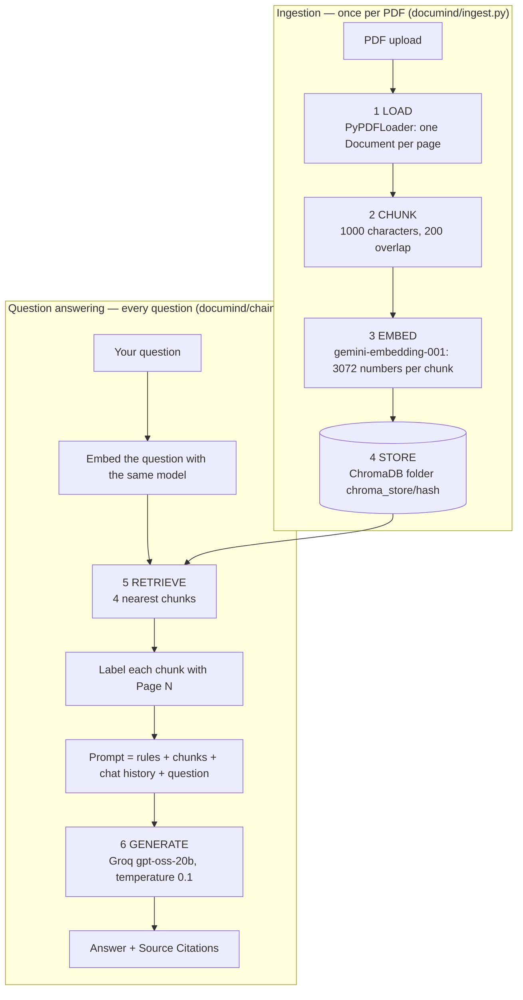

# 🧠 DocuMind AI — Chat with Any PDF Document

> Upload a PDF, ask questions in plain English, and get answers that come **only from that
> document**, with the page number of every source. Built with **Retrieval-Augmented
> Generation (RAG)**, and shipped with an **evaluation harness** that measures whether the
> retrieval actually works.
>
> **Runs entirely on free tiers** — no credit card, no paid API.

**Live app:** <https://rag-project-6ylnda4iefkkdjhggo4aks.streamlit.app>

[](https://python.org)
[](https://langchain.com)
[](https://streamlit.io)
[](https://groq.com)
[](https://aistudio.google.com)
[](https://trychroma.com)

This README is written so that someone who has **never built an AI app** can understand the
whole project: what it does, every word it uses, what happens inside when you click a button,
what each file is for, why each choice was made, how well it works, and what it cannot do yet.

---

## Table of Contents

1. [The project in one minute](#1-the-project-in-one-minute)
2. [The problem it solves](#2-the-problem-it-solves)
3. [Words you need first](#3-words-you-need-first)
4. [What you see when you use it](#4-what-you-see-when-you-use-it)
5. [What happens inside, step by step](#5-what-happens-inside-step-by-step)
6. [One question, traced from start to finish](#6-one-question-traced-from-start-to-finish)
7. [Every file in the project](#7-every-file-in-the-project)
8. [Every setting, and why it has that value](#8-every-setting-and-why-it-has-that-value)
9. [The tools used, and why each was chosen](#9-the-tools-used-and-why-each-was-chosen)
10. [Run it yourself](#10-run-it-yourself)
11. [Evaluation: does it actually work?](#11-evaluation-does-it-actually-work)
12. [Current status: done, partial, not built](#12-current-status-done-partial-not-built)
13. [Known limitations](#13-known-limitations)
14. [What to build next](#14-what-to-build-next)
15. [Frequently asked questions](#15-frequently-asked-questions)
16. [Interview cheat sheet](#16-interview-cheat-sheet)
17. [Further reading and credits](#17-further-reading-and-credits)

---

## 1. The project in one minute

DocuMind AI is a website where you:

1. paste two free API keys (or use the ones the host provides),
2. upload a PDF (a textbook, a report, a contract, lecture notes),
3. click **Analyze Document**,
4. ask questions in a chat box.

Each answer is written by an AI model that is **only allowed to use text from your PDF**. Under
every answer you can open **Source Citations** to see exactly which pages the answer came from.
If the answer is not in the PDF, the app is instructed to say *"I could not find this
information in the uploaded document."* instead of guessing.

The project has two halves:

| Half | What it is | Where |
|---|---|---|
| **The app** | The website and the RAG pipeline behind it | `app.py`, `documind/`, `assets/` |
| **The evaluation harness** | A set of scripts that test the app with known questions and score it | `eval/` |

The second half is what makes this more than a demo: most RAG projects stop at "it seemed to
work when I tried it". This one measures it, and found real problems by measuring.

---

## 2. The problem it solves

An **LLM** (Large Language Model, the kind of AI behind ChatGPT) only knows what was in the
text it was trained on. It has never seen *your* PDF. If you ask it about your company's
internal report, it either says it doesn't know or, worse, **makes up a confident answer**.
Making things up is called **hallucination**.

There are two ways to give an LLM knowledge of your document:

| Approach | How | Problem |
|---|---|---|
| **Fine-tuning** | Re-train the model on your documents | Slow, costs money, must be redone every time a document changes, and still does not give reliable facts or page numbers |
| **RAG** (this project) | Leave the model alone. At question time, *find* the relevant pages and paste them into the question | Only as good as the "finding" step |

**Analogy: an open-book exam.** The LLM is the student. Your PDF is the book. RAG is a helper
who, for every question, opens the book to the right 4 pages and hands them to the student, with
the rule "answer only from these pages, and say which page you used".

That reframes the whole engineering problem:

> **A RAG system is only as good as its retrieval.** If the right page never reaches the
> student, no amount of clever instructions saves the answer.

This is why the evaluation harness scores **retrieval separately from the final answer**.

---

## 3. Words you need first

Every other section uses these words. Read this table once and the rest will make sense.

| Word | Plain meaning | In this project |
|---|---|---|
| **PDF text layer** | The real, selectable text inside a PDF. A *scanned* PDF is only pictures of pages and has no text layer. | The app reads the text layer. Scanned PDFs are rejected with a clear message. |
| **Chunk** | A small piece of the document's text. | At most 1000 characters (about 150–250 words). |
| **Chunk overlap** | Neighbouring chunks share some text, so a sentence cut at a boundary still appears whole in one of them. | 200 characters. |
| **Token** | The unit LLMs read and write: a word or part of a word (roughly 3–4 English characters). | Used to limit answer length. |
| **Embedding** | A list of numbers that captures the *meaning* of a text. Texts with similar meaning get numbers that are close together, even if they use different words. | Each chunk becomes 3072 numbers. |
| **Vector** | Just another name for that list of numbers. | Same as embedding here. |
| **Vector database / vector store** | A database that stores vectors and can quickly find the ones closest to a new vector. | ChromaDB, saved as a folder on disk. |
| **Similarity search** | "Find the stored vectors closest to the question's vector." | Returns the 4 closest chunks. |
| **Retrieval** | The "finding the right pages" step. | Steps 1–5 below. |
| **Generation** | The "writing the answer" step, done by the LLM. | Step 6 below. |
| **Top-k** | "Take the k best matches." | k = 4. |
| **LLM** | Large Language Model, the AI that writes text. | `openai/gpt-oss-20b`, hosted by Groq. |
| **Prompt** | The full text sent to the LLM: instructions + context + question. | Built fresh for every question. |
| **System prompt** | The standing instructions at the top of the prompt that set the LLM's rules. | 5 rules, the most important being "use only the context". |
| **Context** | The retrieved chunks pasted into the prompt. | 4 chunks, each labelled `[Page N]`. |
| **Temperature** | How random the LLM's word choices are. 0 = always the most likely word; higher = more creative. | 0.1 for answers (stable), 0.3 for the summary. |
| **max_tokens** | The most tokens the LLM may produce in one reply. | 1024. |
| **API** | A way for your program to use another company's service over the internet. | Google for embeddings, Groq for the LLM. |
| **API key** | A secret password that identifies you to an API. | Two keys: `GOOGLE_API_KEY` and `GROQ_API_KEY`. |
| **Rate limit / quota** | How many requests a free plan allows per minute / per day. | Google's daily embedding quota is the main limit of this project. |
| **Hash** | A short fingerprint computed from a file's bytes. Same file → same hash; one byte changed → completely different hash. | First 12 characters of the SHA-256 hash name each PDF's storage folder. |
| **Cache** | Saved results reused instead of recomputed. | A PDF uploaded twice is not re-embedded. |
| **Hallucination** | The AI confidently stating something that is not true or not in the source. | Measured by the evaluation using "trap" questions. |
| **Streamlit** | A Python library that turns a Python script into a website. | The whole UI (`app.py`). |
| **Session state** | Streamlit's memory for one browser tab. Streamlit re-runs the whole script on every click, so anything to remember must live here. | Holds the chat, the loaded document, and the stats. |
| **BM25** | A classic *keyword* search method (from 1994): ranks text by how often the question's words appear in it. No AI. | Used in the evaluation as a "dumb baseline" to check the AI search is worth it. |
| **Recall@k** | "Did the right page appear among the top k results?" as a percentage over many questions. | The main retrieval score. |

---

## 4. What you see when you use it

### The sidebar (left side)

1. **Two password boxes** for the Google and Groq API keys. They start empty.
   - If you type a key, the app uses yours.
   - If you leave a box empty, the app falls back to the **host's key** (from the `.env` file
     locally, or from the hosting platform's *Secrets* settings when deployed).
   - If neither exists, the app shows *"⚠️ Both API keys required above."*
2. **An upload box** that accepts only `.pdf` files.
3. **🚀 Analyze Document** button. Clicking it processes the PDF (Section 5). While it works you
   see *"🔍 Embedding & indexing your document..."*, then *"✅ Document ready!"*, or a red error
   message if something failed.
4. After a document is ready, a **stats panel**: number of pages, estimated read time, and word
   count. The word count is a real count of the PDF's words; read time assumes about 200 words
   per minute.
5. **💾 Export Chat** downloads the conversation as a `.txt` file, and **🗑️ Clear Chat** empties
   it (the document stays loaded).

### The main area

- **Before any document is loaded:** a welcome page explaining the app, with feature cards and
  a four-step "how it works" strip.
- **After a document is loaded:**
  - a bar showing the file name and its stats,
  - a **3-bullet summary** of the document (written by the LLM from the first 5 pages),
  - three **suggested questions** to click ("What is the main topic of this document?",
    "What are the key findings or conclusions?", "Are there any risks or challenges
    mentioned?"),
  - the **chat box**: type a question and press Enter,
  - under every answer, a collapsed **📎 4 Source Citations** section. Open it to see each
    retrieved chunk's page number and its first 380 characters.

The design is a dark theme and adapts to phone screens.

---

## 5. What happens inside, step by step

There are two phases. **Ingestion** runs once per PDF, when you click Analyze. **Question
answering** runs on every question.



### When you click "Analyze Document" (in `app.py`)

1. The chat is reset.
2. The uploaded file is written to a **temporary file**, because the PDF reader needs a real file
   path, not bytes in memory.
3. Pages and words are counted for the stats panel.
4. The **summary** is generated (`generate_summary`). If it fails, the summary shows the error
   instead of stopping the upload.
5. The app tries to **reuse a saved index** for this exact PDF (`load_existing_vectorstore`).
   If there is none, or it is out of date, it **builds a new one** (`process_pdf`).
6. The **question-answering parts** (retriever, LLM, prompt) are built once
   (`create_qa_chain`) and kept in session state for every later question.
7. The temporary file is deleted.

### Step 1 · LOAD — read the PDF

`PyPDFLoader` reads the PDF's text layer and returns **one `Document` per page**. A `Document`
is the text plus **metadata** (extra labels); the important label is the page number. Page
numbers are stored counting from 0, so the app adds 1 when showing them to people.

### Step 2 · CHUNK — cut pages into pieces

```python
RecursiveCharacterTextSplitter(chunk_size=1000, chunk_overlap=200,
                               separators=["\n\n", "\n", ". ", " ", ""])
```

- The whole document cannot be sent with every question: it is slow, costly, and long prompts
  make answers worse. So the text is cut into chunks and only the best few are sent.
- The **separators** are tried in order: blank line (paragraph break), line break, end of a
  sentence, space, and only as a last resort, anywhere. So chunks prefer to end at natural
  boundaries.
- The splitter works **page by page**: a chunk never spans two pages (verified: 0 of 792 chunks
  did). That keeps page citations exact.
- If **no chunks** come out (a scanned PDF), the app stops with *"No text could be extracted
  from this PDF. It may be a scanned document; OCR is not supported yet."* instead of building an
  empty index that would answer "not found" to everything.

### Step 3 · EMBED — turn text into meaning-numbers

Each chunk is sent to Google's `gemini-embedding-001`, which returns **3072 numbers**. Chunks
*about the same thing* get similar numbers even when they use different words. This is what lets
the app answer a question phrased completely differently from the PDF's wording.

### Step 4 · STORE — save to ChromaDB

- The vectors, the chunk text and the page numbers are saved to **ChromaDB**, a vector database
  that runs inside the app and saves to a folder on disk (no separate server).
- The folder name is the **hash of the PDF's bytes**: `chroma_store/<first 12 characters of the
  SHA-256 hash>/`. The same file uploaded again — even renamed — gets the same folder, so its
  saved index is reused and **no embedding API calls are spent**.
- Next to the index, an `index_meta.json` file records how it was built:

  ```json
  {"embed_model": "models/gemini-embedding-001", "chunk_size": 1000, "chunk_overlap": 200, "n_chunks": 71}
  ```

  A saved index is reused **only if** those settings still match the current ones **and** the
  number of stored vectors equals `n_chunks`. Otherwise it is rebuilt. This protects against two
  real problems: an index built with old settings being silently reused, and an index left
  half-built by a failed embedding call looking complete (the evaluation hit exactly this: an
  index holding 200 of 275 vectors). Before rebuilding, the old vectors are deleted, so old and
  new are never mixed.

### Step 5 · RETRIEVE — find the 4 best chunks

The question is embedded with the **same** model, and ChromaDB returns the **4 nearest chunks**.

*A detail interviewers like:* ChromaDB measures closeness with "squared L2 distance" (straight-line
distance). Gemini's vectors all have length 1, and for length-1 vectors squared L2 equals
`2 − 2 × cosine similarity`, so the ranking is exactly the same as ranking by cosine similarity
(checked on a stored index to four decimals).

Note: retrieval uses **only your latest question**, not the chat history. See
[Known limitations](#13-known-limitations).

### Step 6 · GENERATE — write a grounded answer

The 4 chunks are joined into one block of text, each labelled `[Page N]`, and placed into the
**system prompt**:

```
You are DocuMind AI, an expert document analyst assistant.
RULES YOU MUST FOLLOW:
1. ONLY use information explicitly found in the provided context.
2. If the answer is not in the context, clearly say: "I could not find this information in the uploaded document."
3. Always be concise, structured, and professional.
4. For complex answers, use bullet points or numbered lists for clarity.
5. When you use information from a specific part of the document, mention the page number.
DOCUMENT CONTEXT:
{context}
```

The full message list sent to the LLM is: the system prompt (with the chunks filled in), then
the **earlier chat turns** (so follow-ups make sense to the model), then your new question.

The LLM is `openai/gpt-oss-20b` on Groq, at **temperature 0.1** (stable, factual) with
**max_tokens 1024**. It is a *reasoning model*: it thinks in hidden tokens before writing the
visible answer. Very rarely it returns an empty answer, so the app **retries once**, and if the
answer is still empty it shows *"The model returned an empty answer. Please ask again."*

The answer and the 4 source chunks go back to `app.py`, which shows the answer and the
**Source Citations**.

---

## 6. One question, traced from start to finish

Say you uploaded a 72-page **MySQL handbook** and ask: *"How do you create a database?"*

| # | What happens | Where |
|---|---|---|
| 1 | You press Enter. The question is added to the chat and shown. | `app.py` |
| 2 | `run_qa()` is called with the question and the earlier chat turns. | `documind/chain.py` |
| 3 | The question is turned into 3072 numbers by Google. | Google API |
| 4 | ChromaDB compares it with the handbook's 71 stored chunks and returns the 4 closest, including the chunk on page 5 that contains `CREATE DATABASE startersql;`. | `chroma_store/<hash>/` |
| 5 | The 4 chunks are labelled `[Page 5]`, `[Page …]` and joined. | `format_docs()` |
| 6 | The prompt (rules + chunks + history + question) is sent to Groq. | Groq API |
| 7 | gpt-oss-20b writes an answer that uses the page-5 text and cites page 5. | Groq API |
| 8 | If the answer were empty, the app would ask once more. | `run_qa()` |
| 9 | The answer appears with **📎 4 Source Citations** underneath; the pair (question, answer) is saved for follow-ups. | `app.py` |

(The handbook and its page are real examples from the evaluation corpus; the exact answer wording
depends on the model.)

---

## 7. Every file in the project

```
rag-project/
├── app.py                  the website (Streamlit). Stays at the top level because
│                           Streamlit Cloud runs this file.
├── documind/               the RAG engine, as a Python package (a folder of .py files)
│   ├── __init__.py         runs first: two start-up fixes, then makes the functions importable
│   ├── settings.py         EVERY setting in one place (models, sizes, prompt)
│   ├── ingest.py           steps 1–4: load, chunk, embed, store, reuse
│   ├── chain.py            steps 5–6: retrieve, prompt, answer
│   └── summary.py          the 3-bullet summary on upload
├── assets/
│   └── style.css           all the visual styling (colours, cards, phone sizes)
├── docs/
│   ├── how-it-works.md         the pipeline explained with code
│   └── evaluation-findings.md  everything the evaluation discovered
├── eval/                   the evaluation harness (see eval/README.md)
│   ├── config.py           shared settings; imports the app's settings
│   ├── build_index.py      builds test indexes for each chunk size
│   ├── run_eval.py         the scorer
│   ├── generate/           scripts that BUILD the test questions
│   ├── verify/             scripts that CHECK the harness itself
│   ├── data/               the question sets and the corpus list
│   └── results/summary.json  the current numbers
├── .streamlit/config.toml  Streamlit theme
├── requirements.txt        the exact library versions
├── .env.example            template for your API keys (.env itself is never committed)
└── chroma_store/           created automatically: one saved index per PDF (never committed)
```

### `app.py` — the screen

Draws everything you see (Section 4) and keeps the conversation in session state. It contains
**no RAG logic**: it calls functions from `documind/` and shows the results. It also reads
`assets/style.css` and injects it into the page.

### `documind/__init__.py` — runs first

Python runs a package's `__init__.py` before any other file in it, so two start-up fixes live here:

1. **UTF-8 output fix.** Old Windows terminals cannot print some characters and would crash on
   log lines; this switches output to UTF-8 (the standard character encoding).
2. **SQLite swap.** ChromaDB needs SQLite (a small database engine) version 3.35 or newer.
   Streamlit Community Cloud's Linux machines ship an older one, so the app crashed there. The
   fix installs `pysqlite3-binary` (Linux only) and swaps it in under the name `sqlite3` before
   ChromaDB is imported.

It then re-exports the main functions so `app.py` can simply write `from documind import run_qa`.

### `documind/settings.py` — the control panel

Holds every number, model name and the system prompt (Section 8). The app **and** the evaluation
read their settings from here, so the evaluation always tests exactly what the app runs.

### `documind/ingest.py` — preparing the document

| Function | In → out | Job |
|---|---|---|
| `get_pdf_hash(pdf_path)` | file → 12-character fingerprint | Names the PDF's storage folder |
| `_index_settings()` | nothing → dict | The settings a saved index must match |
| `process_pdf(pdf_path, google_api_key)` | PDF → ready vector store | Steps 1–4; raises an error for scanned PDFs |
| `load_existing_vectorstore(pdf_path, google_api_key)` | PDF → saved store, or `None` | Reuses a saved index only if it is current and complete |

### `documind/chain.py` — answering

| Function | In → out | Job |
|---|---|---|
| `page_label(metadata)` | `{"page": 3}` → `"4"` | Human page number, or `"?"` if missing (never crashes) |
| `format_docs(docs)` | chunks → one text block | Adds `[Page N]` labels; also used by the evaluation |
| `create_qa_chain(vector_store, groq_api_key)` | store → `{retriever, llm, prompt}` | Built once per PDF |
| `run_qa(chain_components, question, chat_history)` | question → `{answer, source_documents}` | One full turn: retrieve, generate, retry if empty |

### `documind/summary.py`

`generate_summary(pdf_path, groq_api_key)` sends the text of the **first 5 pages** to the LLM at
temperature 0.3 and asks for exactly 3 bullet points. On any error it returns the error as a
bullet instead of crashing. It does not use the index.

### `eval/` — the evaluation harness

Covered in [Section 11](#11-evaluation-does-it-actually-work) and in full in
[`eval/README.md`](eval/README.md). It **never changes the app**: it only imports the app's
prompt, formatter and settings, and builds its own indexes in `eval/chroma_eval/`.

---

## 8. Every setting, and why it has that value

All of these live in [`documind/settings.py`](documind/settings.py).

| Setting | Value | Why this value |
|---|---|---|
| `CHUNK_SIZE` | 1000 characters | Big enough for a full paragraph or short code example; small enough that 4 chunks make a short prompt (~4000 characters). The eval also tests 500 and 2000. |
| `CHUNK_OVERLAP` | 200 characters | 20% of the chunk size, so a sentence cut at a boundary appears whole in the next chunk. A usual range is 10–20%. |
| `CHUNK_SEPARATORS` | paragraph, line, sentence, space, anywhere | Cut at natural boundaries first. |
| `TOP_K_RESULTS` | 4 | Enough evidence for most questions while keeping the prompt short. The eval also tests 8. |
| `EMBED_MODEL` | `models/gemini-embedding-001` | Free tier, strong quality, 3072 dimensions. |
| `GEN_MODEL` | `openai/gpt-oss-20b` | Free on Groq and very fast. |
| `GEN_TEMPERATURE` | 0.1 | Almost no randomness: factual answers from a document should be stable. |
| `GEN_MAX_TOKENS` | 1024 | Room for hidden reasoning plus the answer. Measured use: ~170 tokens median, 391 worst case. |
| `SUMMARY_PAGES` | 5 | Fewer pages = fewer tokens = faster and cheaper summary. |
| `SUMMARY_TEMPERATURE` | 0.3 | Slightly freer wording is fine for a summary. |
| `CHROMA_BASE_DIR` | `./chroma_store` | Where saved indexes live. |
| `INDEX_META_FILE` | `index_meta.json` | The "how was this index built" record. |
| `SYSTEM_PROMPT` | 5 rules | Grounding, the exact refusal sentence (the evaluation detects it), page citations. |

---

## 9. The tools used, and why each was chosen

| Layer | Tool | Why this one |
|---|---|---|
| Website | **Streamlit** | A chat UI in pure Python; free hosting on Streamlit Community Cloud |
| Glue | **LangChain** | Ready-made PDF loader, text splitter, vector-store wrapper and model clients that all fit together |
| PDF reading | **PyPDFLoader** (pypdf) | Keeps page numbers, which citations depend on |
| Embeddings | **Google `gemini-embedding-001`** | Free tier, 3072-dimensional, good quality |
| Vector database | **ChromaDB** | Runs inside the app, saves to disk, no server and no cost |
| Answer model | **Groq `openai/gpt-oss-20b`** | Free tier; Groq's hardware makes answers near-instant |
| Grading (evaluation only) | **Groq `openai/gpt-oss-120b`** | A *larger* model grades the smaller one; a model grading its own answers inflates scores |

### Why two API keys?

Two different companies do two different jobs, and at the time neither offered both for free:

- **Groq** gives free, fast LLMs but **has no embedding service**.
- **Google** gives free embeddings, but its free-tier chat models were not available on this key.
- The original plan was to make embeddings **locally** with a small model (MiniLM), but Windows
  blocked PyTorch (the library it needs) on the development laptop, so embeddings moved to Google.

### Could a local LLM write the answers?

Yes on a laptop, but not on the free website:

- Streamlit Community Cloud's free machines have a few GB of memory and **no GPU**; gpt-oss-20b
  needs about 16 GB, so the live site would need a paid server.
- Models small enough for a normal laptop (~3 billion parameters) follow the "answer only from
  the context" rules noticeably worse, and without a GPU they write only a few words per second.
- The answer model is created in one place (`create_qa_chain` in `documind/chain.py`), so
  switching to a local model (for example through **Ollama**) is a small code change. The right
  way to do it is to run the evaluation before and after and compare.

---

## 10. Run it yourself

### 1 · Install Python and the libraries

You need **Python 3.12**. In a terminal, inside the project folder:

```bash
pip install -r requirements.txt
```

`requirements.txt` pins **exact versions** (for example `langchain==1.3.14`), because the
LangChain/Chroma libraries change often and an unpinned install can break weeks later with no
change on your side.

### 2 · Get two free API keys

| Key | Where to get it | Used for | Looks like |
|---|---|---|---|
| `GOOGLE_API_KEY` | [aistudio.google.com/app/apikey](https://aistudio.google.com/app/apikey) | Embeddings | starts with `AIza` |
| `GROQ_API_KEY` | [console.groq.com/keys](https://console.groq.com/keys) | Answers and summary | starts with `gsk_` |

Copy `.env.example` to a new file called `.env` in the project folder and put your keys in it:

```env
GOOGLE_API_KEY=your_key_here
GROQ_API_KEY=your_key_here
```

`.env` is listed in `.gitignore`, so it is never uploaded to GitHub. You can also leave `.env`
out and paste keys into the app's sidebar instead.

### 3 · Start the app

```bash
python -m streamlit run app.py
```

Your browser opens <http://localhost:8501> (`localhost` = this computer, `8501` = the port
Streamlit listens on). Upload a PDF, click **Analyze Document**, ask a question. The terminal
shows `[RAG Engine]` log lines while it works. Press `Ctrl+C` in the terminal to stop.

### 4 · How the live version is deployed

The app runs on **Streamlit Community Cloud**, connected to this GitHub repository. Every push to
`main` redeploys it automatically. On the cloud, the host's keys are stored in the platform's
**Secrets** settings instead of a `.env` file.

> **Free-tier note:** Google's embedding API has a **per-minute** and a **per-day** limit.
> Processing a large PDF can use up the day's allowance in one go; after that, uploads fail with
> `RESOURCE_EXHAUSTED` until it resets. This is a quota limit, not a bug.

---

## 11. Evaluation: does it actually work?

"It seemed fine when I tried it" is not a measurement. The `eval/` folder is a **test harness**:
a fixed set of questions with known right answers, run automatically, scored with numbers. Full
details: [`eval/README.md`](eval/README.md) and
[`docs/evaluation-findings.md`](docs/evaluation-findings.md).

### What is measured — four numbers, kept separate on purpose

| Metric | Question it answers |
|---|---|
| **Recall@k** | Did the retriever bring back the page the answer lives on? |
| **Answer accuracy** | Given those pages, did the LLM write the right answer? (graded by gpt-oss-120b) |
| **Hallucination rate** | On questions the document *cannot* answer, did it make something up instead of refusing? |
| **Truncation rate** | Did the answer get cut off by the token limit? |

Keeping recall and accuracy apart is the point: if answers are wrong, you need to know whether
the **search** handed over the wrong pages or the **LLM** misread the right ones. Those have
opposite fixes.

### How the test questions are made

- Each question is generated from **one specific page**, and that page number is saved as the
  right answer for retrieval. If none of the 4 retrieved chunks comes from that page, retrieval
  failed. This makes scoring objective.
- Some answers appear on more than one page, so every page containing the answer is also
  recorded, and recall is reported both strictly and leniently.
- **Trap questions** ("probes") ask about things the document genuinely does not contain. Each is
  checked to confirm the fact really is absent before it is used.
- Three documents with **different shapes**, so results show where a setting helps:

| Document | Pages | Shape | Chunks at 500 / 1000 / 2000 |
|---|---|---|---|
| MySQL Handbook | 72 | Technical reference: code, tables, short pages | 115 / 71 / 71 |
| BI Exam Companion | 89 | Dense continuous prose | 522 / 275 / 152 |
| Object Recognition Slides | 60 | Lecture slides: sparse, fragmented | 72 / 60 / 60 |

### What the evaluation found

1. **The first test set was too easy.** BM25 — plain keyword search, no AI at all — scored
   **97.7%** recall@4 on it. The questions copied their page's wording (**73%** average word
   overlap), so any keyword matcher could find them. A second, **paraphrased** set was built with
   an automatic filter rejecting any question above 55% overlap: average overlap fell to **21%**
   and BM25 fell to **57.6%**. Running the "dumb" baseline is what exposed this; without it the
   headline would have been a meaningless "100% recall".
2. **Chunk size does nothing on documents with short pages.** The splitter never merges pages, so
   when every page is already under 1000 characters (MySQL, slides), 1000 and 2000 give the same
   chunks. Chunk size only matters on dense documents.
3. **Four bugs were found in the harness itself:** recall credited only one page; the refusal
   detector misfired on real answers; a failed embedding batch left an index with **200 of 275
   vectors** that looked complete; and rate-limited questions were silently dropped. All fixed.
4. **A claim was made, tested, and withdrawn.** An early note said `max_tokens=1024` caused blank
   answers often. 60 controlled generations showed **0 empty answers in 20 trials at 1024**. What
   is true is narrower: an empty answer happens rarely, so the app now retries once.

### Current numbers (partial — read the caveats)

Configuration `baseline` = exactly what the app ships (1000 / 200 / k = 4, meaning-based search).

| Metric | Easy set | Hard (paraphrased) set |
|---|---|---|
| Questions scored | 17 of 48 | 10 of 42 |
| Recall@4 | 100% | 100% |
| Answer accuracy | 100% (15/15) | 100% (10/10) |
| Hallucination rate | 0% (2 traps, both refused) | not measured yet |
| BM25 recall@4 on the same questions | — | **40% (4/10)** |

**What these numbers do and don't say:**

- Every scored question so far is from the **MySQL handbook**; Google's free daily quota ran out
  before the other two documents were reached.
- Coverage is 35% (easy) and 24% (hard). Hallucination was tested on only 2 trap questions.
- The question sets were checked automatically but **not reviewed by hand** (`reviewed: false` on
  all 90).

The honest summary: on the 10 hard questions scored so far, meaning-based search found the right
page 10 times; keyword search found it 4 times on the same questions. That is promising evidence
that the embeddings earn their API call, **on a small sample from one document**.

### Run the checks

```bash
py -3.12 eval/verify/verify_method.py             # checks the harness's assumptions   (no API)
py -3.12 eval/verify/verify_retrieval.py --hard   # BM25 baseline score                (no API)
py -3.12 eval/run_eval.py --hard                  # full scoring run (needs both keys)
```

The eval needs your own PDFs: copy `eval/data/documents.example.json` to
`eval/data/documents.json` and point it at three local PDFs.

---

## 12. Current status: done, partial, not built

| Area | Status |
|---|---|
| Upload, chunk, embed, store, answer with page citations | ✅ Done and deployed |
| Reuse of saved indexes, with stale/half-built protection | ✅ Done |
| Refusal when the answer is not in the PDF | ✅ Done (instructed by the prompt; measured on 2 traps) |
| Retry on empty answers | ✅ Done |
| Summary, stats, export and clear chat, mobile layout | ✅ Done |
| Clean code layout (`documind/` package, one settings file) | ✅ Done (7 Oct 2026) |
| Evaluation harness (questions, traps, scorer, self-checks) | ✅ Built |
| Evaluation results | 🟡 Partial: 27 questions, 1 document |
| Comparison of the 6 configurations (chunk size, k, hybrid) | 🟡 Pending: blocked by Google's daily quota |
| Hybrid search (keyword + meaning) | 🟡 Written and tested in `eval/`, **not used by the app** |
| Query rewriting for follow-up questions | ❌ Not built |
| Reranker | ❌ Not built |
| OCR for scanned PDFs | ❌ Not built |
| Several PDFs at once | ❌ Not built |
| Automated tests | ❌ Not built |

---

## 13. Known limitations

| Limitation | Detail |
|---|---|
| **Follow-up questions** | The LLM sees the chat history, but the *search* uses only the latest question, so vague follow-ups ("and the second one?") find the wrong pages. Query rewriting would fix this. |
| **One PDF at a time** | No question across several documents. |
| **Scanned PDFs** | No OCR: image-only PDFs are rejected. |
| **Tables** | Chunking flattens table layout; table-heavy documents retrieve poorly. |
| **No reranking, meaning-only search** | Top 4 by meaning; no keyword search or second-pass reranker in the app. |
| **Citations are not verified** | The LLM writes the page numbers in its answer; the Source Citations panel shows the true retrieved pages. |
| **Prompt injection** | Retrieved text goes inside the system prompt, so a PDF containing instructions could try to override the rules. Untested in the app. |
| **Shared host keys** | On the deployed app, visitors who leave the key boxes empty use the host's quota. |
| **Free-tier quotas** | Google's daily embedding limit; large PDFs can use it up. |
| **Evaluation coverage** | Partial (Section 11); single trial per question, so small differences are not meaningful. |
| **Not enterprise-grade** | No login, no per-user data separation, no monitoring; built for one user per session. |

---

## 14. What to build next

In order of value:

1. **Finish the evaluation** on all three documents (or switch embeddings to a local library to
   avoid Google's daily quota), so every later change gets a measured before-and-after number.
2. **Hybrid search + a reranker in the app**, shipped only if the evaluation shows a gain. The
   hybrid code already exists in `eval/`.
3. **Query rewriting**, so follow-up questions retrieve the right pages.
4. **Automated tests** that run on every push.
5. **Prompt-injection hardening**: put the retrieved text in clearly marked delimiters with a
   "treat this as data" rule.
6. **OCR fallback** for scanned PDFs, then **multi-document** search.

---

## 15. Frequently asked questions

**Does it ever make things up?**
It is instructed not to, and on the 2 trap questions tested it refused correctly. That sample is
too small to promise anything; the evaluation is built to measure it properly once the quota allows.

**Why does it need the page to be in the top 4?**
The LLM only sees the 4 retrieved chunks. If the right page is not among them, the LLM cannot
use it. That is why retrieval quality is measured separately.

**Why is the same PDF instant the second time?**
Its saved index is found by the file's hash and reused, so no embedding calls are made.

**Why 1000 characters per chunk?**
A common starting point that fits a full paragraph. The evaluation is set up to compare 500,
1000 and 2000; one result is already known — on short-page documents 2000 behaves exactly like 1000.

**Why Groq and not OpenAI?**
Free tier and very fast responses. The model it runs, gpt-oss-20b, is an open-weight model
released by OpenAI.

**Is my PDF sent anywhere?**
Its text is sent to Google (to make embeddings) and the retrieved chunks to Groq (to write
answers). The index is saved on the machine running the app.

**Why are there `[RAG Engine]` lines in the terminal?**
They are progress logs from `documind/ingest.py`, useful when debugging. They are not shown on the page.

---

## 16. Interview cheat sheet

**30-second pitch:**
"DocuMind is a chat-with-your-PDF app built on retrieval-augmented generation. It splits a PDF
into 1000-character chunks, turns each into a 3072-number embedding with Google's Gemini model,
and stores them in ChromaDB. For each question it finds the 4 closest chunks and gives them to
gpt-oss-20b on Groq with strict instructions to answer only from them and cite pages. The part
I'm proudest of is the evaluation harness: it showed my first test set was so easy that plain
keyword search scored 97.7%, so I built a paraphrased set where keyword search drops to 57.6%."

**Numbers you can quote safely:**

| What | Value |
|---|---|
| Chunk size / overlap / k | 1000 / 200 characters / 4 |
| Embedding size | 3072 numbers |
| LLM settings | gpt-oss-20b, temperature 0.1, max_tokens 1024 |
| BM25 recall@4, easy vs hard set | 97.7% vs 57.6% |
| Question–page word overlap, easy vs hard | 73% vs 21% |
| Hard questions scored: dense vs BM25 | 10/10 vs 4/10 (one document, small sample) |
| Half-built index caught by the harness | 200 of 275 vectors |

**Say honestly:** it is an MVP for one user and one PDF at a time; the evaluation is partial;
hybrid search exists only in the evaluation; query rewriting and reranking are not built yet.

---

## 17. Further reading and credits

| Document | What it covers |
|---|---|
| [`docs/how-it-works.md`](docs/how-it-works.md) | The pipeline with code, the architecture diagram, why each tool was chosen |
| [`docs/evaluation-findings.md`](docs/evaluation-findings.md) | Everything the evaluation found, defect by defect |
| [`eval/README.md`](eval/README.md) | The evaluation harness in full: every script, every number, how to run it |

Built with LangChain, ChromaDB, Streamlit, Groq and Google AI Studio — all on free tiers.
